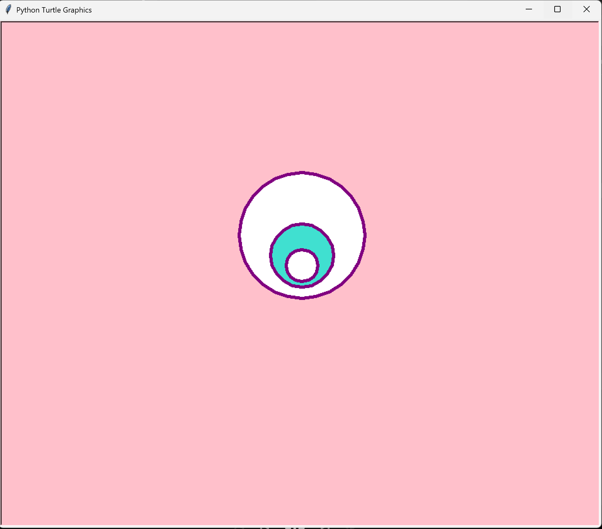

# Turtle Targets - Concentric Circles Design

A Python graphics program that creates a target/bullseye design using nested circles with decreasing radii.

## Overview

This project demonstrates fundamental concepts of Python Turtle Graphics including coordinate positioning, shape rendering, and color management. The program draws three concentric circles to create a visual target pattern.

## Program Details

**Programmer:** Marlena Fabrick  
**Date Written:** September 20, 2020  
**Language:** Python 3.x  
**Library:** Turtle Graphics

## Features

- **Concentric Circle Design:** Creates 3 nested circles with varying radii
- **Color Management:** Uses white, turquoise, and white fill colors
- **Coordinate Positioning:** Precise placement using absolute coordinates
- **Shape Filling:** Demonstrates fill operations and color application

## How It Works

The program draws three circles in a nested pattern:

1. **Outer Circle:** Radius 100 pixels (White)
2. **Middle Circle:** Radius 50 pixels (Turquoise)
3. **Inner Circle:** Radius 25 pixels (White)

All circles are centered along the y-axis, creating a target-like appearance.

## Code Structure

```python
import turtle

def draw_circle(pen, x, y, radius, fill_color):
    pen.fillcolor(fill_color)
    pen.begin_fill()
    pen.penup()
    pen.goto(x, y)
    pen.pendown()
    pen.circle(radius)
    pen.end_fill()

# Draw three nested circles
draw_circle(pen, 0, -36, 100, "white")
draw_circle(pen, 0, -18, 50,  "turquoise")
draw_circle(pen, 0, -9,  25,  "white")

turtle.done()
```

## Key Concepts

- **Turtle Graphics Module:** Python's built-in graphics library
- **Coordinate System:** Using `goto()` for absolute positioning
- **Shape Filling:** `begin_fill()` and `end_fill()` operations
- **Circle Drawing:** Creating circles with specified radius
- **Color Management:** Setting pen and fill colors

## Running the Program

1. Ensure Python 3.x is installed
2. Run the program:
   ```bash
   python Fabrick_Marlena_A2_Targets.py
   ```
3. A window will appear showing the target design
4. The window stays open until you close it manually

## Output

A pink background with a purple-outlined target design featuring three nested circles in white, turquoise, and white.

## 📸 Screenshots

### Finished Design



## Skills Demonstrated

✓ Turtle graphics library usage  
✓ Coordinate system understanding  
✓ Geometric shapes (circles)  
✓ Color and fill operations  
✓ Program flow control  

## Requirements

- Python 3.x
- tkinter (usually included with Python)
- turtle module (built-in)

## Learning Objectives

After running this program, you will understand:

- How to initialize turtle graphics
- How to position objects using coordinates
- How to fill shapes with colors
- How to draw circles with different radii
- How to create visual patterns using nesting
- How to use the built-in turtle library effectively

## Possible Enhancements

- Add animation (circles growing/shrinking)
- Change colors dynamically
- Create multiple targets
- Add mouse interactivity
- Create variations with different shapes
- Add text labels to the design

## Real-World Applications

This project demonstrates concepts used in:

- **Computer Graphics:** Shape rendering and positioning
- **Data Visualization:** Creating visual patterns
- **Game Development:** Drawing sprites and game objects
- **Educational Software:** Visual learning tools
- **Design Applications:** Pattern generation

## Author

Marlena Fabrick

## License

MIT License - See LICENSE file for details

---

**Version:** 1.0  
**Last Updated:** 2024  
**Status:** Complete & Tested
